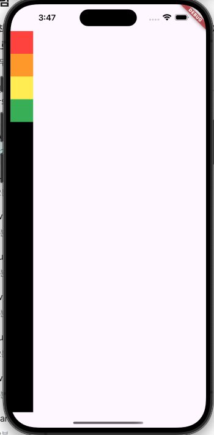

# React Native

1. 개요
   * facebook에서 개발한 오픈 소스 프레임 워크
   * 모바일 앱을 개발할때 사용
   * 하나의 소스코드로 Android와 iOS App을 생성할수 있는 Cross Platform 개발기술
   * JavaScript로 코딩하며, React library를 사용
2.
   필요성
3. 특징
4. 사용방법
5. 래퍼런스 모음


반드시 React <> React Native 이지만, React도 해야함..

* React 자체는 Vue.js || Angular 와 같은 언어...?


* 모바일 앱 개발기술
  * Native App 개발은 Android == SDK, iOS == XCode
  * Hybrid App 개발은 Cordova || Ionic
  * Web App 개발은 반응형 웹 사이트를 모바일로 접속
  * Cross Platform App은 React Native, Flutter, Xamarin 으로 안드로이드와 iOS 앱을 생성


* React Native 장점
  * 개발자가 JS에 익숙할 경우 코딩이 쉬움
  * Cross Platform 이기 때문에 생산성이 높음
  * Native App에 근접한 성능
  * 단방향 데이터 흐름이기에 App을 이용하기 용이
  * Native App의 컴파일 과정이 불필요
  * 코드 테스트시, Hot Reloading 되어 소스코드 변경이 빠르게 반영됨


* 개발자가 알아야 할 것들
  * JavaScript & TypeScript
  * ES6
  * React
  * React Native
  * Emulator
  * Editor || IDE


* React Native App
  * 프로젝트를 생성하여 개발
  * React Native 프로젝트를 생성하려면 React Native CLI || Expo CLI 사용
  * React Native CLI : 좀 더 Native에 가까워서 Android Emulator 에서 실행가능
  * Expo CLI : 가볍긴 하지만 Emulator 사용 불가능
  * React Native CLI 설치
    *   기존 CLI 제거

        npm uninstall -g react-native-cli @react-navive-communoty/cli
    *   react Native CLI 설치

        npm install -g react-native-cli
    *   프로젝트 실행

        npx react-native run-android


*   React&#x20;

    * JSX : JavaScript XML을 의미
    * JavaScript언어의 확장 문법
    * 최상위 요소(View)가 반드시 있어야 함
    *   {}로 자바 표현을 사용할 수 있음

        \-> {/\* 주석 표현 \*/}
    * 태그는 반드시 닫아야 함
    *

        ```javascript
        // 태그 안에 스타일은 아래와 같이 선언
        style={{backgroundColor:'blue'}}
        /* 주석은 이렇게 선언 */
        ```


    * React의 화면은 컴포넌트의 조합으로 구성됨 -> 화면 == 컴포넌트들의 조립
    * 컴포넌트는 함수형, 클래스 형으로 정의 가능
    * 정의된 컴포넌트를 Import 해서 사용가능
    * 생명주기
      * 마운팅 : 생성자, render, componentDidMount 실행
      * 갱신 : 갱신
      * 언마운팅 : 제거, componentWillUnmount 실행
    *   componentDidMount : 컴포넌트가 로딩된 후 실행

        \-> Ajax로 수신한 데이터를 처리하는 코드를 넣어두기 적절한 메소드
    * props == Properties : 상위 컴포넌트로부터 전달된 데이터나 상속받은 값을 참조할때 사용
    *
        state : 데이터를 다루는 방식중 하나, 단순 구조의 자바스크립트의 객체

        \-> Hook 방식의 useState를 사용하여 상태를 관리


* React Hook
  * 렌더링 하기전에 정보를 모아두는 것
  * Android Native의 옵져버, 구독 패턴이라고 보는게 맞는듯 함
  * 특정 이벤트 시기에 어떤 객체나 변수를 어떻게 조절할 것인지 구조화&#x20;


* React Native Component
  * 기본 컴포넌트
    * View
    * Text
    * Image
    * TextInput
    * ScrollView
    * StyleSheet
  * User Interface
    * Button
    * Swith
  * List Views
    * FlatList
    * SectionList


* React Native Style
  * Javascript 객체로 컴포넌트 스타일 지정
  * Inline으로도 적용은 가능하나, 재사용측면에서 추천하지 않음


<figure><figcaption><p>반드시 맞출 것!!!! 2시간 반 버림..</p></figcaption></figure>


*   Navigation

    * 모바일 앱에서는 주로 세가지 형태의 Navigation을 다룸
      * 탭 형식의 Navigation : 위나 아래에 탭이 있고 누르면 해당 탭으로 이동
      * 스택 기반의 Navigation : 화면들이 스택으로 쌓여 있다가 출력
      * Drawer 형태의 Navigation : 왼쪽이나 오른쪽에서 나타나는 사이드 메뉴
    * React Navive에서는 컴포넌트 기반이로 Navigation이 이루어짐
    * 모듈은 포함되어 있지 않기에 Third Party Library를 이용


```bash
# navigation
npm install @react-navigation/native
npm install react-native-screens react-native-safe-area-context

# stack navigation
npm install @react-navigation/native-stack
```


* Context
  * 여러 화면에서 공유해야되는 데이터들
  * Web에서의 Session 개념이라고 보면 될듯함..


* Redux
  * JavaScript App에서 사용하는 예측 가능한 상태 컨테이너
  * 컴포넌트 사이에서 데이터를 공유하는 작업
  * 사용하기 복잡하고 App이 복잡해지긴함
  * 컴포넌트에서 액션을 호출, 액션은 리듀서를 거쳐서 스토어에 저장된 값을 업데이트, 값이 업데이트 되면 컴포넌트에서 렌더링이 다시 수행

```bash
npm install redux react-redux @reduxjs/toolkit
```

* Reducer
  * App의 현재 상태를 취하고 액션을 수행하며 새로운 State를 리턴하는 함수
* Store
  * App의 State를 유지
  * App 전체에서는 하나의 State만이 존재
  * 헬퍼 메서드를 통해 저장된 State를 참조, 수정, 리스너 등록, 리스너 해체 가능
* Action
  * type 속성을 가지고 Redux의 dispatch 함수로 Action으로 호출하면 앱의 모든 리덕션에 호출


* Server 연동
  * Fetch API, XMLHttpRequest API 사용
  * fetch함수를 호출하여 매개변수로 URL을 전달
  *   fetch함수는 Promise를 리턴

      \-> Default: 비동기, async & await 동기로 사용

